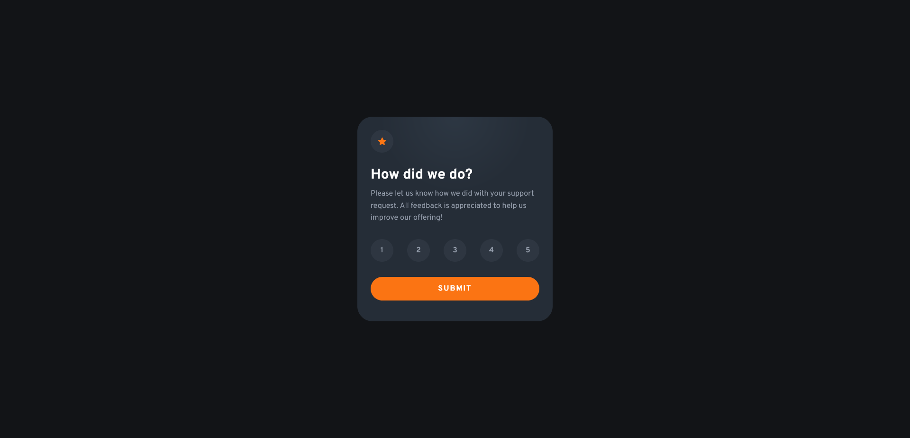

# Frontend Mentor - Interactive rating component solution

This is a solution to the [Interactive rating component challenge on Frontend Mentor](https://www.frontendmentor.io/challenges/interactive-rating-component-koxpeBUmI). Frontend Mentor challenges help you improve your coding skills by building realistic projects. 

## Table of contents

- [Overview](#overview)
  - [The challenge](#the-challenge)
  - [Screenshot](#screenshot)
  - [Links](#links)
- [My process](#my-process)
  - [Built with](#built-with)
  - [What I learned](#what-i-learned)
  - [Continued development](#continued-development)
- [Author](#author)
- [Acknowledgments](#acknowledgments)

**Note: Delete this note and update the table of contents based on what sections you keep.**

## Overview

### The challenge

Users should be able to:

- View the optimal layout for the app depending on their device's screen size
- See hover states for all interactive elements on the page
- Select and submit a number rating
- See the "Thank you" card state after submitting a rating

### Screenshot

### Links

- [Solution URL](https://www.frontendmentor.io/challenges/interactive-rating-component-koxpeBUmI/hub)
- [Live Site URL](https://benevolent-quokka-946252.netlify.app/)

## My process

### Built with

- Semantic HTML5 markup
- CSS custom properties
- CSS Grid
- Mobile-first workflow
- Vanilla JS

**Note: These are just examples. Delete this note and replace the list above with your own choices**

### What I learned

Got to dive back into JS after a long hiatus, felt kind of like starting from scratch, but I got things figured out with the help of a friend and a lot of googling!
The main thing I learned is how to attach and handle eventHandlers.

**Note: Delete this note and the content within this section and replace with your own learnings.**

### Continued development

I'll definitely have to keep practicing my JS.

**Note: Delete this note and the content within this section and replace with your own plans for continued development.**

## Author

- Frontend Mentor - [@JonathanRe](https://www.frontendmentor.io/profile/JonathanRe)
- Twitter - [@kuogames](https://www.twitter.com/kuogames)

**Note: Delete this note and add/remove/edit lines above based on what links you'd like to share.**

## Acknowledgments

Shoutout to Adrian with the assist on a bug I was stuck on for a while.

**Note: Delete this note and edit this section's content as necessary. If you completed this challenge by yourself, feel free to delete this section entirely.**
